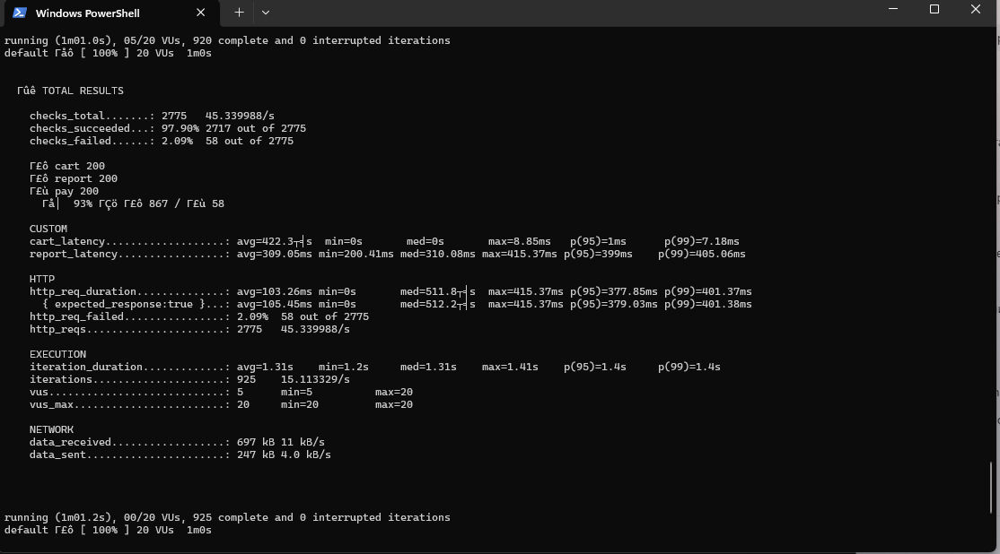

# Лаб 03 — Чанарын сценарио, SLO, k6 threshold

М. Билгүүн-Эрдэнэ
B222270046

## Орчин

OS: Windows, PowerShell
Node.js: v25.5.0
npm: 11.8.0
Express: 5.2.1
k6.exe v2.2.0 (commit/00a9a1b7f5, go1.26.5, windows/amd64)
Сервер: http://localhost:3000

## Baseline хэмжилт

20 VU, 1 минутын турш локал API-ийн гурван endpoint-ийг шалгав.

| Хэмжүүр | Үр дүн |
|---|---:|
| Cart p95 | 1 ms |
| Cart p99 | 7.18 ms |
| Report p95 | 399 ms |
| Report p99 | 405.06 ms |
| Нийт хүсэлт | 2775 |
| Амжилттай хүсэлт | 2717 |
| Алдаатай хүсэлт | 58 |
| Нийт HTTP error rate | 2.09% |
| Payment error rate — тооцоолсон | 58 / 925 × 100 ≈ 6.27% |
| Availability — тооцоолсон | 2717 / 2775 × 100 ≈ 97.91% |

Cart latency-ийн SLO-г baseline p95 × 1.5 буюу
1 ms × 1.5 = 1.5 ms гэж сонгов.

[Бүтэн гаралт](results/baseline.txt)

## Чанарын туршилт

| Хэсэг | Performance | Reliability | Availability |
|---|---|---|---|
| Тойм | Сагсанд бараа нэмэх хүсэлтийг хурдан боловсруулах | Төлбөрийн хүсэлтийг найдвартай боловсруулах | Сервер зогссоны дараа үйлчилгээг сэргээх |
| Системийн төлөв | API ажиллаж байгаа, 20 VU | API ажиллаж байгаа, 20 VU | API эхэндээ ажиллаж байгаа, 20 VU |
| Орчны төлөв | Локал орчин, 1 минутын хэвийн ачаалал | Локал орчин, төлбөрийн хүсэлтийн ойролцоогоор 5%-д зориуд алдаа үүсгэдэг | Локал орчин, 2 минутын тестийн дунд серверийг 10 секунд зогсооно |
| Гадаад өдөөлт | Хэрэглэгч POST /cart/add хүсэлт илгээнэ | Хэрэглэгч POST /pay хүсэлт илгээнэ | Ажиллаж буй сервер гэнэт зогсоно |
| Шаардлагатай хариу | HTTP 200 хариуг тогтоосон хугацаанд буцаах | Төлбөрийн хүсэлтийг зөвшөөрөгдөх алдааны түвшинд боловсруулах | Серверийг дахин асаасны дараа амжилттай хүсэлтүүдийг үргэлжлүүлэн боловсруулах |
| Хэмжүүр | Cart latency p95 < 1.5 ms; p99-ийг мөн тайлагнана | Payment error rate < 8% | Нийт хүсэлтийн амжилтын хувь ≥ 90%; зогссоноос анхны амжилттай хариу хүртэлх сэргэлт ≤ 15 секунд |

### Нэмэлт — Report performance

| Хэсэг | Тодорхойлолт |
|---|---|
| Тойм | Тайланг зөвшөөрөгдөх хугацаанд үүсгэх |
| Системийн төлөв | API ажиллаж байгаа, 20 VU |
| Орчны төлөв | Локал орчин, 1 минутын хэвийн ачаалал; endpoint 200–400 ms зориуд хүлээнэ |
| Гадаад өдөөлт | Хэрэглэгч GET /report хүсэлт илгээнэ |
| Шаардлагатай хариу | HTTP 200 болон тайлангийн өгөгдлийг буцаах |
| Хэмжүүр | Report latency p95 < 450 ms; p99-ийг мөн тайлагнана |

## SLO ба threshold

| Сценарио | SLI | SLO босго | Цонх / нөхцөл | k6 threshold |
|---|---|---|---|---|
| Performance | Cart latency | p95 < 1.5 ms | 20 VU, 1 минут, хэвийн ажиллагаа | p(95)<1.5 |
| Reliability | Payment error rate | < 8% | 20 VU, 1 минут, хэвийн ажиллагаа | rate<0.08 |
| Availability | Амжилттай хүсэлтийн хувь | ≥ 90% | 20 VU, 2 минут, 10 секундийн зогсолт | rate>=0.90 |
| Report performance | Report latency | p95 < 450 ms | 20 VU, 1 минут, хэвийн ажиллагаа | p(95)<450 |

### Босго сонгосон үндэслэл

- Cart: baseline p95 = 1 ms тул 50%-ийн нөөцтэйгээр 1 × 1.5 = 1.5 ms сонгов.
- Reliability: сервер ойролцоогоор 5% алдаа үүсгэдэг, baseline payment error rate ойролцоогоор 6.27% байсан тул 8% босго сонгов.
- Availability: энэ лабораторийн туршилтад хүсэлтийн 10% хүртэлх алдааг зөвшөөрөх 90% зорилт сонгов.
- Report: зориудын 200–400 ms хүлээлт болон baseline p95 = 399 ms-ийг харгалзан 450 ms сонгов.
- Сэргэлтийн 15 секундийн зорилт нь төлөвлөсөн 10 секундийн зогсолт дээр дахин асах 5 секундийн нөөц нэмсэн таамаг бөгөөд chaos туршилтаар шалгана.

### Error budget

Цагаар тооцсон харьцуулалтын budget:

120 секунд × (1 − 0.90) = 12 секунд.

Харин үндсэн availability SLI нь хүсэлтээр хэмжигдэнэ:

- Availability = амжилттай хүсэлт / нийт хүсэлт × 100%.
- Зөвшөөрөгдөх алдаатай хүсэлт = нийт хүсэлт × 0.10.

Chaos туршилтын дараа бодит хүсэлтийн тоогоор budget-ийг шалгана.
Сэргэлтийн хугацааг тусад нь хэмжинэ; checks threshold нь сэргэлтийн
хугацааг автоматаар шалгахгүй.